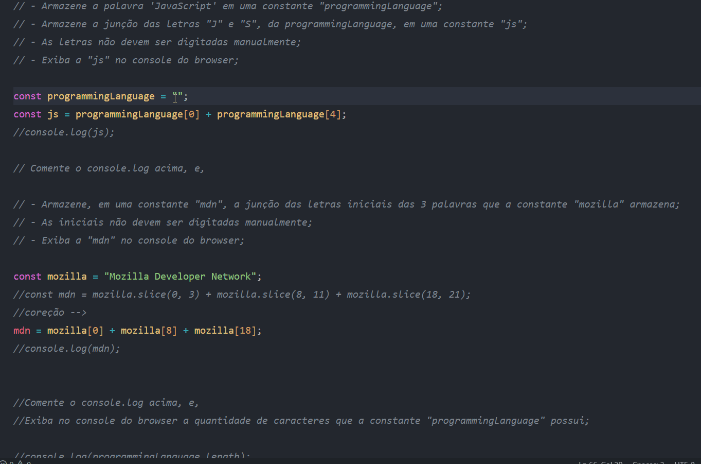

# Projeto JavaScript Exercises 📚👩🏾‍💻💊⌨

🖐🏽 Neste repositório estão/estarão as questões que estou resolvendo no apredizado de JavaScript.

⏳ Este repositório está sendo atualizado com várias questões de nível básico e intermediário, na medida em que vou agrupando-as por tipo e nível de dificuldade.

## Tecnologias

- JavaScript

